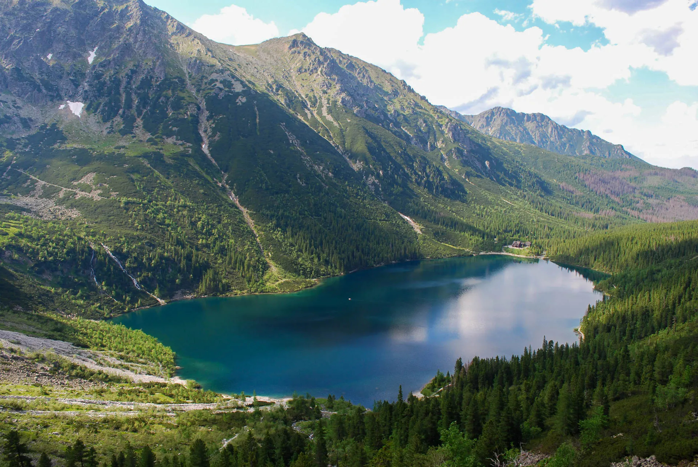
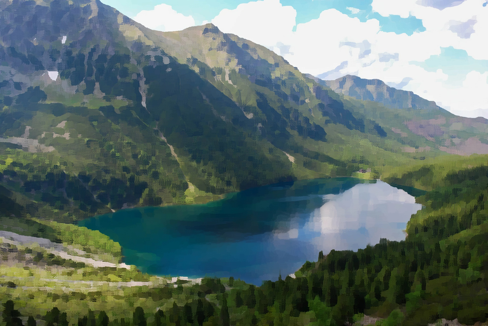
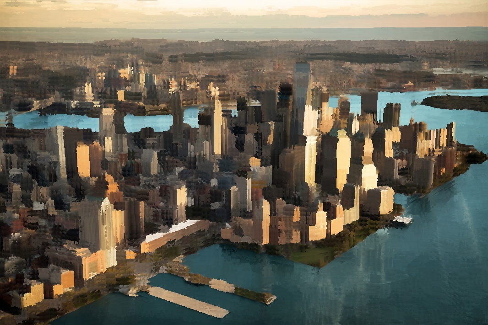

# Kuwahara Filter
This is a C++/CUDA/OpenMP implementation of the [Kuwahara filter](https://en.wikipedia.org/wiki/Kuwahara_filter)

# Implementations
There are three branches with three separate implementations of the same algorithm. 
This project aims to measure execution time differences between sequential and parallel code, including GPU parellelization.

# Usage
There's a dependency on **OpenCV**, so make sure it's installed.
## Compile
```bash
cmake .
make
```
## Run
```bash
./kuwahara INPUT_IMAGE_PATH OUTPUT_IMAGE_PATH [--window WINDOW_SIZE]
```
# Examples

| Original Image | Radius 9 | Radius 17 |
|:--------------:|:---------------------------:|:----------------------------:|
|  |  |  |
|  |  |  |
|  |  |  |
|  |  |  |

# Performance Benchmarks
**TODO**

# Author
Michał Miłek
